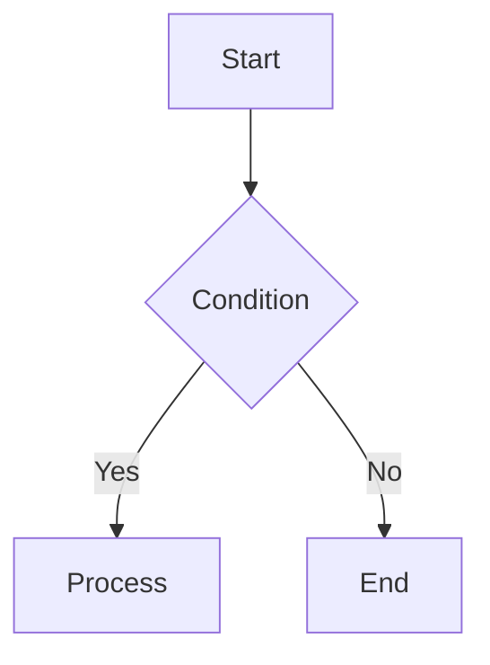
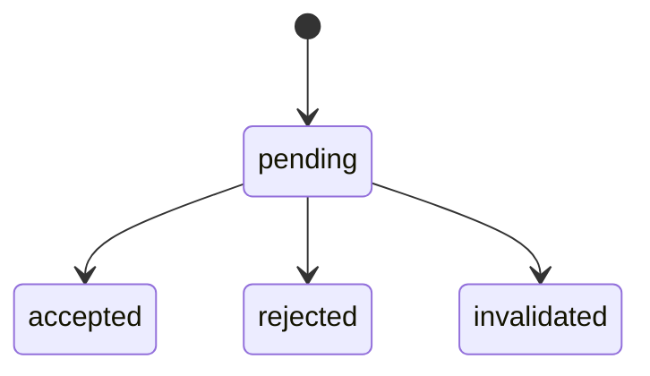

# Specification Document Guidelines

## Overview

Rules for writing specification documents placed under `docs/specifications/`.

## File Rules

- Format: **Markdown** (`.md`)
- Location: `docs/specifications/`
- File name: **English kebab-case** (e.g., `organization-registration-flow.md`)
- **Split files per flow** — do not combine multiple flows into one file

## Writing Rules

| Item | Rule |
|------|------|
| Title | English (H1 heading) |
| Body | Written in Japanese |
| Overview section | Required — explain the purpose in ~3 sentences |
| Diagrams | Must include a sequence diagram or flowchart (use mermaid) |
| Status transitions | If status transitions exist, must include a state diagram (mermaid stateDiagram) |
| Length | Keep concise — do not include implementation details (code, SQL, etc.) |

## Section Structure

```
# {Flow Name}

## 概要

(~3 sentences describing purpose, actor, and trigger)

## 前提条件

(Actor, required permissions, dependent data, etc.)

## フロー

(Sequence diagram or flowchart + brief notes per step)

## ステータス遷移 (if applicable)

(State diagram)

## 備考

(Constraints, security considerations, downstream flows, etc.)
```

## Diagram Syntax

### Sequence Diagram

```mermaid
sequenceDiagram
  Actor ->> System: action
  System ->> DB: query
  DB -->> System: result
  System -->> Actor: response
```

### Flowchart



### State Diagram



## What NOT to Include

- Implementation code or SQL
- Infrastructure configuration details
- Content duplicated in other specification documents
- Unconfirmed specs — if uncertain, note "TBD" in the 備考 section
